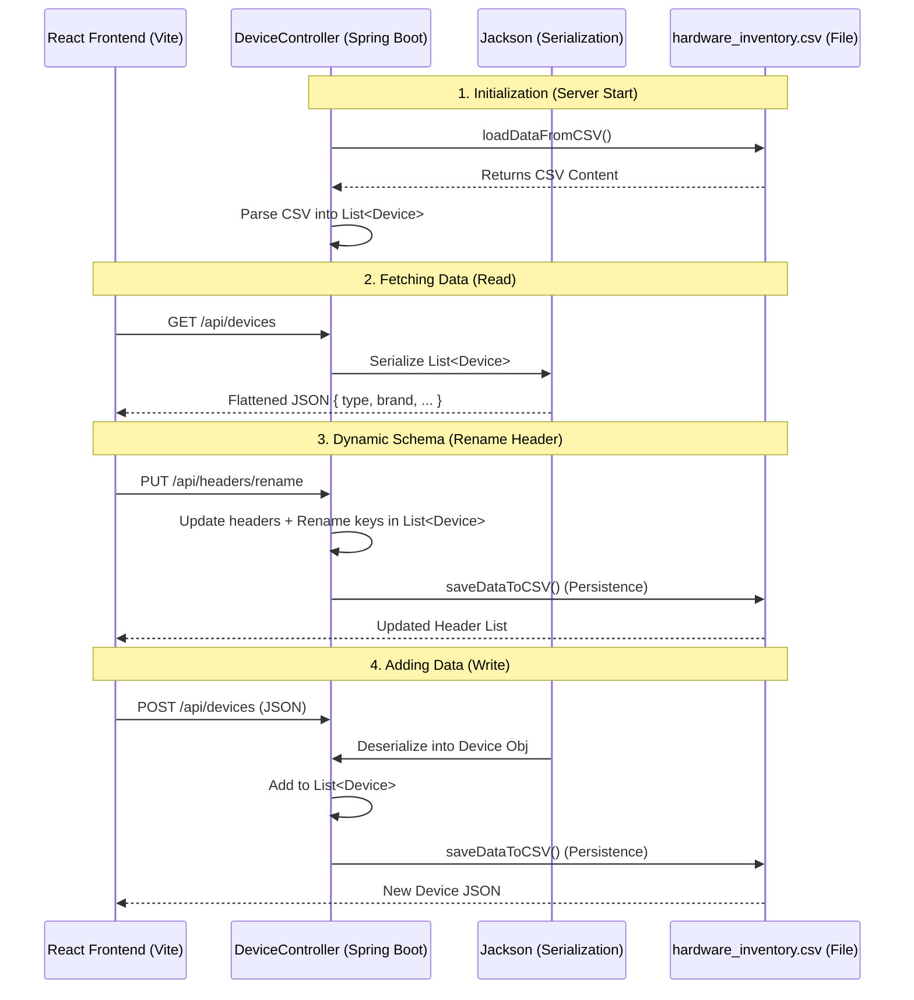

# HardwareTracker

A flexible hardware inventory management system with a dynamic schema backend.

## 🚀 Overview

HardwareTracker is designed to manage hardware inventory without being restricted by a rigid database schema. The backend uses a CSV-based storage system that allows users to add, rename, and delete columns on the fly.

## 📊 Data Flow

The following diagram illustrates how data moves from the persistent CSV storage to the React frontend.



## 🛠️ Technology Stack

- **Frontend**: React (Vite)
- **Backend**: Spring Boot 4.0.3, Java 21
- **Storage**: CSV (Pseudo-Database)
- **Communication**: REST API (JSON via Jackson)

## 💡 How to use the Diagram in GitHub

GitHub supports Mermaid diagrams natively. To ensure the diagram shows up correctly:

1. Copy the block starting with ` ```mermaid ` and ending with ` ``` `.
2. Paste it into your `README.md` file.
3. GitHub will automatically render it into a visual diagram.

> [!TIP]
> If you are seeing plain text instead of a diagram, make sure there are no spaces before the backticks (```) and that the word `mermaid` follows the first set of backticks immediately.

## 🏃 Running the Project

1. Run `Start_Hardware_Tracker.bat` in the root directory to start both backend and frontend.
2. The frontend should be available at `http://localhost:5173`.
3. The backend API is at `http://localhost:8080/api`.
